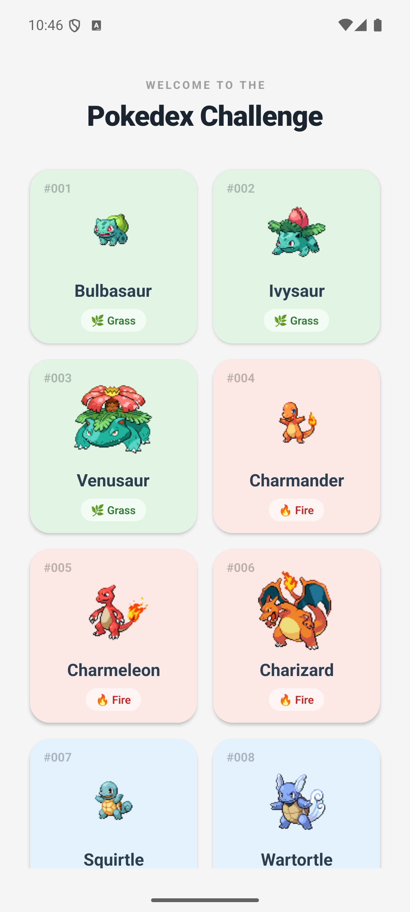
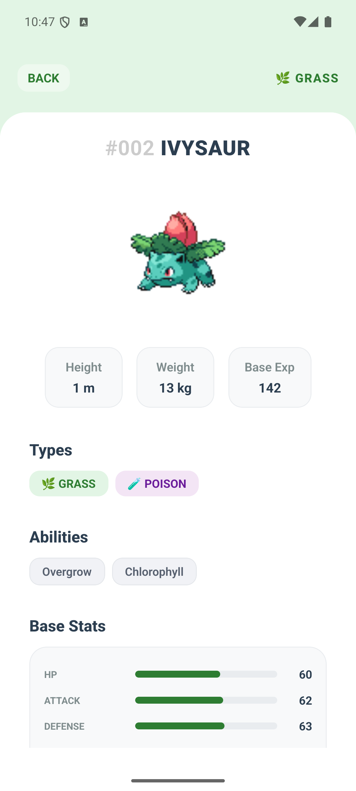
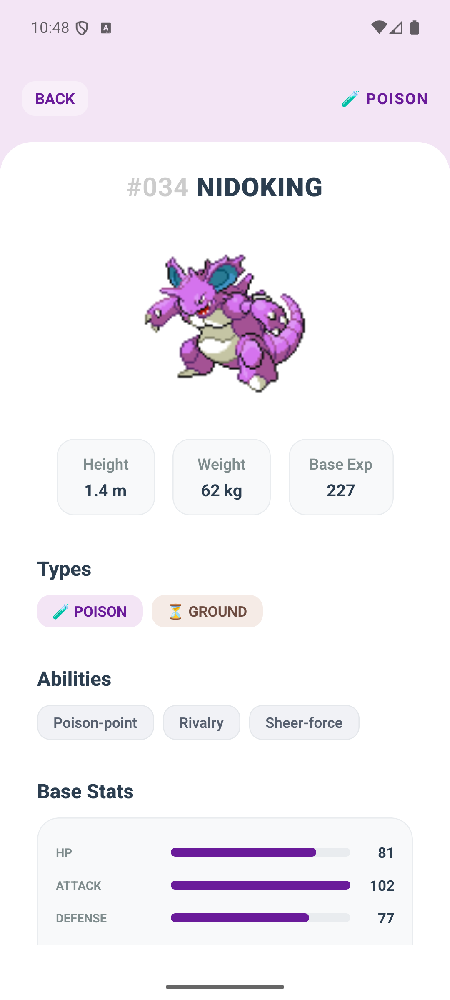

# Pokédex Challenge - React Native (Expo)

Este proyecto implementa una solución móvil para la visualización de la Pokédex utilizando la PokeAPI pública, desarrollada con un enfoque de código limpio, mantenible y escalable.

## 📸 Evidencia de Funcionamiento

<table align="center" width="100%">
  <tr>
    <td align="center" width="25%" valign="top">
      <b>Menu</b><br /><br />
      
    </td>
    <td align="center" width="25%" valign="top">
      <b>Detalle - 1</b><br /><br />
      
    </td>
    <td align="center" width="25%" valign="top">
      <b>Detalle - 2</b><br /><br />
      
    </td>
    <td align="center" width="25%" valign="top">
      <video src="" width="220" style="display: block;" autoplay muted loop playsinline>
https://github.com/user-attachments/assets/e0a39620-8a0f-40e0-bce8-38ca7123c98c
</video>
    </td>
  </tr>
</table>

## 🛠️ Arquitectura y Decisiones Técnicas

Para cumplir con los requerimientos técnicos y asegurar un código limpio, robusto y escalable, implementé las siguientes soluciones:

### 1. Clean Architecture & Principios SOLID

La aplicación está dividida en tres capas desacopladas con responsabilidades únicas:

- **Domain (Dominio):** Contiene el corazón del negocio (Entidades, Interfaces de Repositorios y Casos de Uso) en TypeScript, totalmente independiente de librerías externas o frameworks de UI.

- **Data (Datos):** Implementa el consumo de red y almacenamiento local. Mapea las respuestas de la API (`DTOs`) hacia las entidades de dominio usando el patrón Mapper, evitando que cambios en la API rompan la interfaz.

- **Presentation (Presentación):** Implementa el patrón **MVVM** mediante Custom Hooks que manejan de forma reactiva el estado de la UI (Loading, Success, Error y Empty State).

## 🚀 Stack Tecnológico y Justificación

Para desarrollar el reto, elegí un stack basado en estándares de la industria móvil, priorizando agilidad, tipado seguro y rendimiento:

- **React Native con Expo:** Lo seleccioné para unificar el desarrollo en una sola base de código robusta para Android e iOS, agilizando la configuración inicial del entorno y garantizando una interfaz fluida, consistente y adaptable a diferentes tamaños de pantalla.
- **TypeScript:** Lo decidí implementar para asegurar un tipado estricto en la arquitectura, previniendo errores en tiempo de ejecución y garantizando contratos claros.
- **Axios:** Lo elegí por encima de fetch para centralizar la configuración de red, manejar límites de tiempo (timeout) y estructurar un cliente global limpio.
- **React Navigation (Native Stack):** Lo seleccioné como el equivalente funcional a Navigation con Fragments, garantizando transiciones fluidas entre pantallas y gestionando el envío de parámetros de forma segura bajo el ciclo de vida nativo.
- **AsyncStorage:** Lo integré para cumplir con el requisito de persistencia local mediante una estrategia de caché en la capa de datos. Si la aplicación se queda sin internet, el repositorio detecta la falla y recupera de forma automática la última información guardada en el dispositivo, asegurando que la app siga funcionando y ofreciendo una experiencia offline parcial.

## 🌟 Requisitos Adicionales Completados

1. Carga Incremental (Scroll Infinito): Implementé un scroll infinito utilizando el componente FlatList con la propiedad onEndReached para disparar la paginación por demanda, optimizando el consumo de memoria al cargar más Pokémon solo cuando el usuario lo requiere.

2. Mejoras de UI/UX: Interfaz interactiva con estados visuales de carga (ActivityIndicator) , paletas de colores dinfámicas adaptadas según el tipo principal de cada Pokémon y diseño responsivo en diferentes tamaños de pantalla

3. Manejo Centralizado de Errores: Controlé las fallas de red mediante bloques try/catch dentro de los ViewModels, mostrando alertas claras al usuario e incluyendo un botón de Reintento para recuperar los datos sin reiniciar la app.

4. Accesibilidad: Adapté la aplicación para que sea compatible con lectores de pantalla mediante etiquetas nativas, optimicé el tamaño de las zonas de toque para facilitar la navegación y asegurar un buen contraste y legibilidad de los textos.

5. Optimizaciones de Rendimiento: Utilicé el hook useCallback para congelar las referencias de las funciones de la lista, evitando re-renders innecesarios en las tarjetas de los Pokémon, e integré la caché local offline.

6. Calidad de Código: Configuré ESLint para auditar el código TypeScript en tiempo real y asegurar las reglas de los hooks, junto con Prettier para estandarizar automáticamente el formato del código.

## 🚀 Instrucciones de Ejecución

### Prerrequisitos

- Node.js (v18 o superior recomendado)
- Expo Go instalado en un dispositivo físico o emulador configurado (Android Studio / Xcode)

### Instalación y Encendido

1. Clonar el repositorio e ingresar a la carpeta del proyecto.
2. Instalar las dependencias del proyecto:
   ```bash
   npm install
   ```
3. Correr el proyecto:
   ```bash
   npx expo start
   ```
